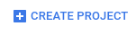

# Python Minichat

Minimal chat example using python on App Engine.

Deployed at <https://python-minichat-145600.appspot.com/>

### 1. Create new project on App Engine

Go to <https://console.cloud.google.com> and click on CREATE PROJECT



Choose a project name for your project:


Install the Google Cloud Tools from here <https://cloud.google.com/sdk/docs/>

Once installed run

    gcloud init
    
Login and select the project you just created.

### 2. Create Python Backend

In your project directory create an `app.yaml` file with the following contents:

```yaml
runtime: python27
api_version: 1
threadsafe: true

handlers:
- url: /static
  static_dir: static
- url: /.*
  script: server.app
- url: /_ah/channel/disconnected/
  script: server.app

inbound_services:
- channel_presence

libraries:
- name: webapp2
  version: latest
- name: jinja2
  version: latest
```

Create a `server.py` file. This will be where the code for your backend python
application lives. The first it needs to do is import the libraries it will
need.

```python
import os
import jinja2
import webapp2

from google.appengine.api import channel
from google.appengine.api import users
from google.appengine.ext import ndb
```

Next it needs to set up the jinja libaries template system. This will help
serve and render serve the `index.html` file later on.

```python
JINJA_ENVIRONMENT = jinja2.Environment(
    loader=jinja2.FileSystemLoader(os.path.dirname(__file__)),
    extensions=['jinja2.ext.autoescape'],
    autoescape=True)
```

Next we need to add our main application:

```python
class MainHandler(webapp2.RequestHandler):
  def get(self):
    # Check if user is logged in
    user = users.get_current_user()
    if user:
      # Create unique chat channel for user and save to active list
      token = channel.create_channel(user.user_id())
      # Add user to active users
      ActiveUser(userid=user.user_id(), id=user.user_id()).put()
      # Render index.html for user
      template = JINJA_ENVIRONMENT.get_template('index.html')
      self.response.write(template.render({'token': token}))
    else:
      self.redirect(users.create_login_url(self.request.uri))

app = webapp2.WSGIApplication([
    ('/', MainHandler),
], debug=True)
```

Now you might notice an `ActiveUser` reference that wasn't defined or imported.
Let's define it! Before `MainHandler` add:


```python
class ActiveUser(ndb.Model):
  userid = ndb.StringProperty()
```

This will help keep track of users currently chatting on our site by storing
them in the App Engine datastore.

Now our app needs a handler for the site to actually send chats to. When a user
send a chat to the backend this handler will send out that message to each
currently active user.

```python
class ChatHandler(webapp2.RequestHandler):
  def post(self):
    user = users.get_current_user()
    message = self.request.body
    if message:
      formatted_message = '%s: %s' % (user.nickname(), message)
      for activeuser in ActiveUser.query():
        channel.send_message(activeuser.userid, formatted_message)
```

And register the url for this handler in the `app` creation at the bottom of the
file.

```python
app = webapp2.WSGIApplication([
    ('/', MainHandler),
    ('/chat', ChatHandler),
], debug=True)
```

Almost done with the backend, just one more handler. Note that the app adds
`ActiveUsers` when they load the site but never removes them. So our app isn't
trying to send chat messages to long gone users we need to add a disconnect
handler.

```python
class DisconnectHandler(webapp2.RequestHandler):
  def post(self):
    userid = self.request.get('from')
    if userid:
      ndb.Key(ActiveUser, userid).delete()
```

Then in the `app` creation add the disconnect url that App Engine uses to notify
our app that a user disconnected from our channel.

```python
app = webapp2.WSGIApplication([
    ('/', MainHandler),
    ('/chat', ChatHandler),
    ('/_ah/channel/disconnected/', DisconnectHandler),
], debug=True)
```

### 3. Create HTML and JavaScript Frontend

Create an `index.html` file with:

- a `div` to display the messages in
- a `form` to send a chat message
- a `script` to load `/_ah/channel/jsapi`
- an inline `script` to initialize the App Engine channel using the token from
  the backend
- a `script` to load `/static/main.js`

```html
<!DOCTYPE html>
<div id="messages"></div>
<form id="message-form">
  <input type="text" id="message">
  <button type="submit">Send</button>
</form>

<script src="/_ah/channel/jsapi"></script>
<script>
  window.channel = new goog.appengine.Channel('{{ token }}');
</script>
<script src="/static/main.js"></script>
```

The `{{ token }}` is replaced with the unique user token by jinja before the
`index.html` is sent to the browser.

Now we need to write the JavaScript to send and receive chat messages. Create a
folder `static` in the project directory then a file in that folder `main.js`.

The first thing to do is create a `Chat` class and bind to the html elements
from `index.html` and open a connection to the python backend.

```js
// Initializes Chat
function Chat() {
  // Shortcuts to DOM Elements.
  this.messageList = document.getElementById('messages');
  this.messageForm = document.getElementById('message-form');
  this.messageInput = document.getElementById('message');

  // Saves message on form submit.
  this.messageForm.addEventListener('submit', this.saveMessage.bind(this));

  // Focus on the input
  this.messageInput.focus();

  // Open Channel connection.
  window.channel.open({
    onopen: function(){},
    onerror: function(){},
    onclose: function(){},
    onmessage: this.displayMessage.bind(this)
  });
}

window.onload = function() {
  new Chat();
};
```

When opening the connection we have the option to specify functions to be called
when other events occur on the channel connection such as a disconnect or an
error. We only need to concern ourselves with the `onmessage` function but feel
free to add `console.log` statements to the other functions to see when they
might be called.

Now there are two functions referenced in the initialization code that need to
be defined `saveMessage` and `displayMessage`. Let's start with displaying a
message.

```js
// Displays a Message in the UI.
Chat.prototype.displayMessage = function(message) {
  var msg = document.createElement('div');
  msg.innerHTML = message.data;
  this.messageList.appendChild(msg);
};
```

This function uses the channel connection to receive the message data from the
backend.

In order to send a message to the backend we will have to open a new connection.

```js
// Sends user's message to the python backend
Chat.prototype.saveMessage = function(e) {
  e.preventDefault();
  // Check that the user entered a message.
  if (this.messageInput.value) {
    // Post message to ChatHandler
    var xhr = new XMLHttpRequest();
    xhr.open('POST', '/chat', true);
    xhr.send(this.messageInput.value);
    // Clear message text field and focus on it.
    this.messageInput.value = '';
    this.messageInput.focus();
  }
};
```

### 4. Test locally

In the project directory run this command to test your project on your machine:

```
dev_appserver.py .
```

You should see something like this when you go to <http://localhost:8080>


Try opening the page in an incognito window to chat as a new user.

### 5. Deploy to App Engine

To deploy your app and make it publicly available run

```
gcloud app deploy
```
